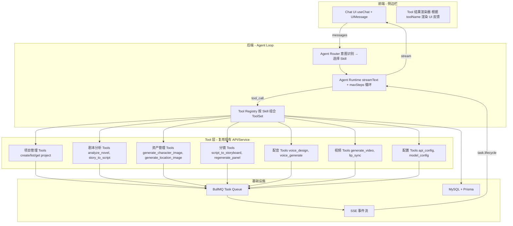
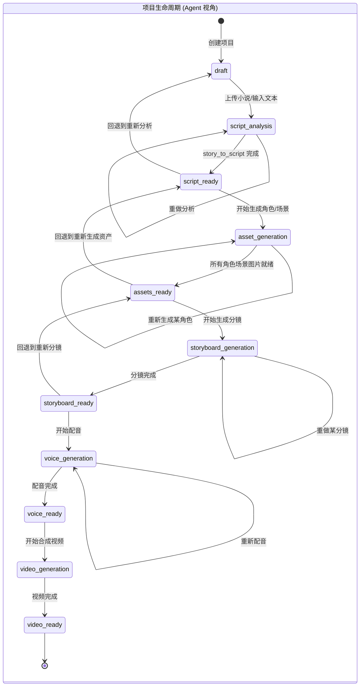
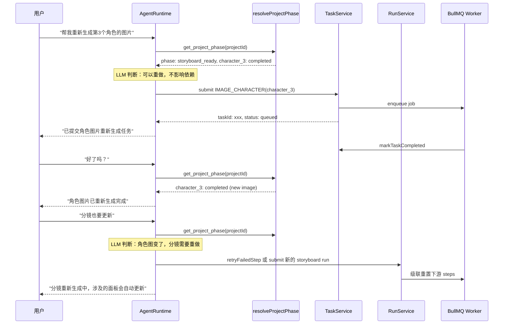
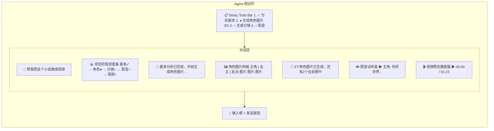

# Untitled

这是一个很好的方向。你的项目已经有了 `assistant-platform` 的雏形（目前只做 API 配置模板和教程），要扩展为全功能 Agent 模式，核心设计如下：

## 整体架构



## 1. Tool 设计 — 按领域分组，复用现有 service 层

你现有的 100+ API route 不需要每个都变成 tool。关键是把它们按用户意图归类为 ~15-20 个高层 tool，内部调用已有的 service 函数：

```typescript
// src/lib/assistant-platform/tools/project-tools.ts
export function createProjectTools(ctx: AgentRuntimeContext): ToolSet {
  return {
    create_project: tool({
      description: '创建新项目，上传小说文本',
      inputSchema: z.object({ name: z.string(), novelText: z.string() }),
      execute: async (input) => {
        // 直接调用现有 service，不走 HTTP
        const project = await projectService.create(ctx.userId, input)
        return { projectId: project.id, status: 'created' }
      },
    }),
    list_projects: tool({ ... }),
    get_project_status: tool({ ... }),
  }
}
```

建议的 tool 分组：

| 领域      | Tools                                                          | 对应现有模块                                     |
| :-------- | :------------------------------------------------------------- | :----------------------------------------------- |
| 项目管理  | `create_project`, `list_projects`, `get_project`               | `src/app/api/projects/`                          |
| 剧本分析  | `analyze_novel`, `story_to_script`, `screenplay_convert`       | workflow-engine + `STORY_TO_SCRIPT_RUN`          |
| 角色/场景 | `generate_character`, `generate_location`, `modify_appearance` | `src/app/api/novel-promotion/` 下的角色/场景 API |
| 分镜      | `script_to_storyboard`, `regenerate_panel`, `insert_panel`     | `SCRIPT_TO_STORYBOARD_RUN` + 分镜 API            |
| 配音      | `voice_design`, `voice_generate`, `assign_speaker_voice`       | voice worker                                     |
| 视频      | `generate_video`, `generate_lip_sync`                          | video worker                                     |
| 资产库    | `browse_assets`, `upload_image`, `modify_asset`                | `src/app/api/asset-hub/`                         |
| 配置      | `get_config`, `save_api_config`, `save_model_template`         | 已有的 `api-config-template` skill               |
| 查询      | `get_task_status`, `get_project_data`                          | task service + SSE                               |

## 2. Agent Loop — 扩展现有 runtime.ts

你已有的 `streamText` + `stopWhen: stepCountIs(maxSteps)` 就是 agent loop 的核心。需要做的改动：

```typescript
// 扩展 runtime.ts 的核心改动
export async function createAgentChatResponse(input: {
  userId: string;
  messages: unknown;
  projectId?: string; // 可选的项目上下文
}): Promise<Response> {
  // 1. 根据对话上下文动态组合 tools
  const tools = {
    ...createProjectTools(ctx),
    ...createScriptTools(ctx),
    ...createAssetTools(ctx),
    ...createStoryboardTools(ctx),
    ...createVoiceTools(ctx),
    ...createVideoTools(ctx),
    ...createConfigTools(ctx),
    ...createQueryTools(ctx),
  };

  // 2. 关键：maxSteps 要足够大，支持多步编排
  const result = streamText({
    model: resolved.languageModel,
    system: buildAgentSystemPrompt(ctx), // 包含项目状态摘要
    messages: await toModelMessages(normalizedMessages),
    tools,
    stopWhen: stepCountIs(20), // agent 模式需要更多步骤
    temperature: 0.3,
  });

  return result.toUIMessageStreamResponse();
}
```

## 3. 异步任务的等待模式 — 这是最关键的设计决策

你的大部分操作（图片生成、视频合成）是异步的，通过 BullMQ 排队。Agent 需要一种方式"等待"任务完成。有两种策略：

**策略 A：Fire-and-Report（推荐先做）**

```typescript
// Tool 提交任务后立即返回 taskId
generate_character_image: tool({
  execute: async (input) => {
    const task = await taskSubmitter.submit({ type: 'IMAGE_CHARACTER', ... })
    return {
      taskId: task.id,
      status: 'queued',
      message: '角色图片生成任务已提交，可用 get_task_status 查询进度'
    }
  },
})
```

LLM 自然会在后续 step 中调用 `get_task_status` 来检查，或者告诉用户"已提交，稍后查看"。

**策略 B：Await-with-Timeout（高级，体验更好）**

```typescript
// Tool 内部轮询等待任务完成
generate_character_image: tool({
  execute: async (input) => {
    const task = await taskSubmitter.submit(...)
    // 等待最多 60s
    const result = await waitForTaskCompletion(task.id, { timeoutMs: 60_000 })
    if (result.status === 'completed') {
      return { status: 'done', imageUrl: result.output.imageUrl }
    }
    return { status: 'timeout', taskId: task.id, message: '任务仍在处理中' }
  },
})
```

## 4. System Prompt 设计 — 注入项目状态

```typescript
function buildAgentSystemPrompt(ctx: AgentRuntimeContext): string {
  return `你是 waoowaoo AI 影视 Studio 的助手。你可以帮用户完成从小说到视频的全流程。

## 当前上下文
- 用户: ${ctx.userId}
${ctx.projectId ? `- 当前项目: ${ctx.projectId}` : "- 未选择项目"}
${ctx.projectSummary ? `- 项目状态: ${ctx.projectSummary}` : ""}

## 工作流程
1. 用户提供小说文本 → 创建项目 → 分析剧本
2. 生成角色/场景图片
3. 生成分镜
4. 配音
5. 合成视频

## 规则
- 执行操作前先确认用户意图
- 长时间任务提交后告知用户预计等待时间
- 如果用户说"一键生成"，按顺序执行完整流程
- 出错时给出具体原因和建议`;
}
```

## 5. 前端侧边栏 — 利用 Vercel AI SDK 的 useChat

你已经用了 `@ai-sdk/react`，直接用 `useChat`：

```tsx
function AgentSidebar() {
  const { messages, input, handleSubmit, isLoading } = useChat({
    api: "/api/user/assistant/agent", // 新的 agent endpoint
    body: { projectId: currentProjectId },
  });

  return (
    <aside className="w-80 border-l">
      {messages.map((msg) => (
        <MessageBubble key={msg.id} message={msg}>
          {/* 关键：渲染 tool 调用结果为可交互 UI */}
          {msg.toolInvocations?.map((inv) => (
            <ToolResultCard key={inv.toolCallId} invocation={inv} />
          ))}
        </MessageBubble>
      ))}
      <ChatInput value={input} onSubmit={handleSubmit} loading={isLoading} />
    </aside>
  );
}
```

## 6. 推荐的实施路径

```plaintext
Phase 1: 扩展现有 assistant-platform
  ├── 新增 AgentId = 'studio-agent'
  ├── 实现 project + query tools（只读操作，风险低）
  └── 侧边栏 UI 骨架

Phase 2: 接入写操作 tools
  ├── 剧本分析、角色生成等 tools
  ├── Fire-and-Report 模式处理异步任务
  └── Tool 结果的 UI 渲染组件

Phase 3: 编排能力
  ├── "一键生成" 等多步编排
  ├── Await-with-Timeout 模式
  └── 项目状态注入 system prompt

Phase 4: 高级特性
  ├── 对话记忆持久化
  ├── 用户确认机制（危险操作前）
  └── 多项目切换上下文
```

核心思路就是：**tool 层是 service 层的薄封装，agent loop 靠 Vercel AI SDK 的 `streamText` + `maxSteps` 驱动，异步任务通过 taskId + 轮询/SSE 桥接**。你现有的 `assistant-platform` 架构已经很适合扩展，不需要推倒重来。

Let me look deeper at the existing state management and workflow patterns.

Now I have a thorough understanding of the existing architecture. Let me provide the design.

---

你的项目已经有两层状态系统：底层的 `Task`（单个异步任务）和上层的 `GraphRun`（多步工作流）。Agent 模式需要在这之上再加一层"项目级编排状态"。核心问题是：**Agent 怎么知道项目走到哪了，下一步该做什么，以及如何重做某一步。**

## 整体状态分层



## 核心设计：不新建状态表，从现有数据"推导"阶段

你已有的 `GraphRun` + `GraphStep` + `GraphArtifact` + `Task` 已经记录了所有执行历史。Agent 不需要额外的状态表，而是通过一个**状态推导函数**实时计算项目当前阶段：

```typescript
// src/lib/assistant-platform/project-phase.ts

export const PROJECT_PHASE = {
  DRAFT: 'draft',                           // 刚创建，无内容
  SCRIPT_ANALYZING: 'script_analyzing',     // story_to_script 进行中
  SCRIPT_READY: 'script_ready',             // 剧本分析完成
  ASSETS_GENERATING: 'assets_generating',   // 角色/场景图片生成中
  ASSETS_READY: 'assets_ready',             // 所有资产就绪
  STORYBOARD_GENERATING: 'storyboard_generating',
  STORYBOARD_READY: 'storyboard_ready',
  VOICE_GENERATING: 'voice_generating',
  VOICE_READY: 'voice_ready',
  VIDEO_GENERATING: 'video_generating',
  VIDEO_READY: 'video_ready',
} as const

export type ProjectPhase = (typeof PROJECT_PHASE)[keyof typeof PROJECT_PHASE]

// 关键：从已有数据推导，不存新字段
export async function resolveProjectPhase(
  projectId: string,
  userId: string,
): Promise<{
  phase: ProjectPhase
  details: PhaseDetails
}> {
  // 1. 查最新的 runs
  const runs = await listRuns({
    userId, projectId,
    latestOnly: true,
  })

  // 2. 查活跃 tasks
  const activeTasks = await prisma.task.findMany({
    where: {
      projectId, userId,
      status: { in: ['queued', 'processing'] },
    },
    select: { type: true, targetType: true, targetId: true, status: true },
  })

  // 3. 查已完成的产物
  const hasScript = runs.some(r =>
    r.workflowType === TASK_TYPE.STORY_TO_SCRIPT_RUN
    && r.status === 'completed'
  )
  const hasStoryboard = runs.some(r =>
    r.workflowType === TASK_TYPE.SCRIPT_TO_STORYBOARD_RUN
    && r.status === 'completed'
  )

  // 4. 查资产完成度
  const characters = await prisma.asset.findMany({
    where: { projectId, type: 'character' },
    select: { id: true, renders: { where: { isSelected: true }, take: 1 } },
  })
  const allCharactersHaveImages = characters.every(c => c.renders.length > 0)

  // ... 类似查 locations, voices, videos

  // 5. 推导阶段（优先级：活跃任务 > 已完成产物）
  if (activeTasks.some(t => t.type === TASK_TYPE.VIDEO_PANEL)) {
    return { phase: PROJECT_PHASE.VIDEO_GENERATING, details: { ... } }
  }
  if (hasAllVideos) {
    return { phase: PROJECT_PHASE.VIDEO_READY, details: { ... } }
  }
  // ... 逐级回退判断
}
```

这个思路的好处是：**与现有 UI 完全一致**——前端也是从 task target states 推导出来的，不存在两套状态不同步的问题。

## Agent 的 "状态感知" Tool 设计

Agent 需要两个核心查询 tool 来感知状态：

```typescript
// Tool 1: 项目全局状态概览
get_project_phase: tool({
  description: "获取项目当前所处阶段和各环节完成情况",
  inputSchema: z.object({ projectId: z.string() }),
  execute: async ({ projectId }) => {
    const { phase, details } = await resolveProjectPhase(projectId, ctx.userId);
    return {
      phase,
      // 给 LLM 结构化的进度信息
      progress: {
        script: details.scriptStatus, // 'completed' | 'running' | 'failed' | 'pending'
        characters: {
          total: details.characterCount,
          withImages: details.charactersWithImages,
          generating: details.charactersGenerating,
        },
        storyboard: details.storyboardStatus,
        voice: {
          total: details.voiceLineCount,
          generated: details.voiceLinesGenerated,
        },
        video: {
          total: details.panelCount,
          generated: details.videosGenerated,
        },
      },
      // 失败的任务列表，Agent 可以决定是否重试
      failedItems: details.failedTasks.map((t) => ({
        taskId: t.id,
        type: t.type,
        targetId: t.targetId,
        error: t.errorMessage,
      })),
      // Agent 可执行的下一步建议
      suggestedActions: details.suggestedActions,
    };
  },
});

// Tool 2: 查询特定目标的任务状态（复用现有 state-service）
get_target_states: tool({
  description: "查询特定目标（角色/分镜/视频等）的任务执行状态",
  inputSchema: z.object({
    projectId: z.string(),
    targets: z.array(
      z.object({
        targetType: z.string(),
        targetId: z.string(),
        types: z.array(z.string()).optional(),
      }),
    ),
  }),
  execute: async ({ projectId, targets }) => {
    // 直接复用现有的 queryTaskTargetStates
    return await queryTaskTargetStates({
      projectId,
      userId: ctx.userId,
      targets,
    });
  },
});
```

## 推进（Advance）的设计

Agent 推进流程不需要特殊机制——它就是按顺序调用 tool。关键是让 LLM 通过 system prompt 理解流程依赖：

```typescript
function buildAgentSystemPrompt(ctx: AgentRuntimeContext): string {
  return `...
## 工作流依赖关系（严格遵守）
1. script_analysis → 必须先有小说文本
2. asset_generation → 必须 script_ready（需要角色/场景列表）
3. storyboard → 必须 assets_ready（需要角色图片做 prompt）
4. voice → 必须 storyboard_ready（需要台词文本）
5. video → 必须 storyboard_ready（需要分镜描述）

## 推进规则
- 每次操作前先调用 get_project_phase 确认当前阶段
- 如果用户要求跳步（如直接生成视频），检查前置条件并告知缺失
- 如果有 failedItems，优先提示用户是否重试
- "一键生成" = 按依赖顺序逐步执行，每步完成后检查状态再继续
...`;
}
```

"一键生成"的 Agent 循环自然就是：

```plaintext
用户: "帮我一键生成完整视频"
Agent step 1: get_project_phase → phase: script_ready
Agent step 2: generate_all_character_images(...)  → 提交任务
Agent step 3: get_project_phase → characters: 3/5 generating
Agent step 4: (等待/轮询) get_project_phase → assets_ready
Agent step 5: start_storyboard(...)
... 直到 video_ready
```

## 重做（Redo/Retry）的设计

重做分两种场景，你已有的基础设施都能覆盖：

**场景 A：任务失败重试** — 直接复用 `retryFailedStep`

```typescript
retry_failed_step: tool({
  description: "重试工作流中失败的步骤，会自动级联重置下游步骤",
  inputSchema: z.object({
    runId: z.string(),
    stepKey: z.string(),
  }),
  execute: async ({ runId, stepKey }) => {
    // 直接调用现有的 retryFailedStep，它已经处理了：
    // 1. 级联失效（resolveRetryInvalidationStepKeys）
    // 2. 清理下游 artifacts
    // 3. 重置 step 状态为 pending
    const result = await retryFailedStep({
      runId,
      userId: ctx.userId,
      stepKey,
    });
    return {
      retried: !!result,
      invalidatedSteps: result?.invalidatedStepKeys || [],
      newAttempt: result?.retryAttempt,
    };
  },
});
```

**场景 B：用户主动重做（对结果不满意）** — 提交新任务覆盖

```typescript
redo_character_image: tool({
  description: '重新生成角色图片（用户对当前结果不满意）',
  inputSchema: z.object({
    projectId: z.string(),
    characterId: z.string(),
    modifyPrompt: z.string().optional(), // 可选的修改指令
  }),
  execute: async ({ projectId, characterId, modifyPrompt }) => {
    if (modifyPrompt) {
      // 走 modify_asset_image 路径（AI 修改）
      return await submitTask({
        type: TASK_TYPE.MODIFY_ASSET_IMAGE,
        targetType: 'character', targetId: characterId,
        payload: { prompt: modifyPrompt },
        ...
      })
    }
    // 走 regenerate 路径（完全重新生成）
    return await submitTask({
      type: TASK_TYPE.IMAGE_CHARACTER,
      targetType: 'character', targetId: characterId,
      ...
    })
  },
})
```

**场景 C：回退到更早阶段** — 这是最复杂的

```typescript
rollback_to_phase: tool({
  description: "回退项目到指定阶段，会清除该阶段之后的所有产物",
  inputSchema: z.object({
    projectId: z.string(),
    targetPhase: z.enum(["script_ready", "assets_ready", "storyboard_ready"]),
    confirm: z.boolean(), // 必须确认，因为会删除数据
  }),
  execute: async ({ projectId, targetPhase, confirm }) => {
    if (!confirm) {
      return {
        status: "needs_confirmation",
        warning: "回退将清除该阶段之后的所有生成结果，请确认",
        affectedData: await previewRollbackImpact(projectId, targetPhase),
      };
    }

    // 1. 取消所有活跃任务
    await cancelActiveTasksAfterPhase(projectId, targetPhase);
    // 2. 标记下游 runs 为 canceled
    await cancelRunsAfterPhase(projectId, targetPhase);
    // 3. 不删除数据，只是让 resolveProjectPhase 重新计算
    //    （因为 runs 被 cancel 了，phase 自然回退）

    return { status: "rolled_back", newPhase: targetPhase };
  },
});
```

## 状态流转的完整时序



## 总结设计要点

1. **不加新状态表** — `resolveProjectPhase()` 从现有 `GraphRun` + `Task` + `Asset` 数据实时推导阶段，与前端 UI 保持一致
2. **推进靠 LLM 自主循环** — system prompt 告诉它依赖关系，`get_project_phase` tool 让它感知当前位置，LLM 自己决定下一步调什么 tool
3. **重做分三级**：
   - 任务失败 → `retryFailedStep`（已有，自动级联失效下游）
   - 结果不满意 → 提交新任务覆盖（`IMAGE_CHARACTER` / `MODIFY_ASSET_IMAGE`）
   - 整体回退 → cancel 下游 runs + tasks，phase 自然回退
4. **级联感知靠 `resolveRetryInvalidationStepKeys`** — 你已有的 workflow-engine 依赖图已经定义了"重做 A 需要连带重做 B、C"，Agent 直接复用

现在我对你的前端现状有了完整了解。你现有的 `AssistantChatModal` 是纯文本 + JSON tool 展示，要升级为 Agent 模式的富交互对话，核心思路是：**tool output 不再渲染 JSON，而是根据 toolName 分发到专用的可视化组件。**

## 1. Tool 结果的富渲染分发器

替换现有的 `<ToolOutput>` 通用 JSON 渲染，改为按 toolName 分发：

```tsx
// src/components/assistant/tool-renderers/index.tsx
import { PhaseProgressCard } from "./PhaseProgressCard";
import { ImageGalleryCard } from "./ImageGalleryCard";
import { VideoPlayerCard } from "./VideoPlayerCard";
import { AudioPlayerCard } from "./AudioPlayerCard";
import { TaskListCard } from "./TaskListCard";
import { StoryboardPreviewCard } from "./StoryboardPreviewCard";

const RENDERERS: Record<string, React.FC<{ output: unknown }>> = {
  get_project_phase: PhaseProgressCard,
  generate_character_image: ImageGalleryCard,
  generate_location_image: ImageGalleryCard,
  regenerate_panel_image: ImageGalleryCard,
  generate_video: VideoPlayerCard,
  voice_generate: AudioPlayerCard,
  script_to_storyboard: StoryboardPreviewCard,
  // 没有专用渲染器的 tool 走默认 JSON
};

export function AgentToolResult({
  toolName,
  output,
  state,
}: {
  toolName: string;
  output: unknown;
  state: string;
}) {
  if (state !== "output-available") {
    return <ToolRunningIndicator toolName={toolName} state={state} />;
  }
  const Renderer = RENDERERS[toolName];
  if (Renderer) return <Renderer output={output} />;
  // fallback: 简洁的 key-value 摘要，不是原始 JSON
  return <DefaultToolSummary output={output} />;
}
```

## 2. 项目阶段进度条 — PhaseProgressCard

这是 `get_project_phase` tool 的渲染结果，始终显示在对话流中：

```tsx
// src/components/assistant/tool-renderers/PhaseProgressCard.tsx
const PHASES = [
  { key: "script", label: "剧本分析", icon: "FileText" },
  { key: "characters", label: "角色生成", icon: "Users" },
  { key: "storyboard", label: "分镜制作", icon: "Layout" },
  { key: "voice", label: "配音", icon: "Mic" },
  { key: "video", label: "视频合成", icon: "Film" },
];

export function PhaseProgressCard({ output }: { output: unknown }) {
  const data = output as ProjectPhaseOutput;
  return (
    <div className="rounded-xl border border-[var(--glass-stroke-base)] bg-[var(--glass-bg-surface)] p-3">
      {/* 横向步骤条 */}
      <div className="flex items-center gap-1 mb-3">
        {PHASES.map((phase, i) => {
          const status = data.progress[phase.key];
          return (
            <Fragment key={phase.key}>
              {i > 0 && (
                <div
                  className={`h-px flex-1 ${
                    status === "completed"
                      ? "bg-emerald-400"
                      : "bg-[var(--glass-stroke-base)]"
                  }`}
                />
              )}
              <div
                className={`flex flex-col items-center gap-1 ${
                  status === "completed"
                    ? "text-emerald-500"
                    : status === "running"
                      ? "text-blue-400"
                      : "text-[var(--glass-text-tertiary)]"
                }`}
              >
                <div
                  className={`w-7 h-7 rounded-full flex items-center justify-center text-xs
                  ${status === "running" ? "ring-2 ring-blue-400/40 animate-pulse" : ""}
                  ${status === "completed" ? "bg-emerald-500/15" : "bg-[var(--glass-bg-soft)]"}
                `}
                >
                  {status === "completed" ? (
                    "✓"
                  ) : (
                    <AppIcon name={phase.icon} className="w-3.5 h-3.5" />
                  )}
                </div>
                <span className="text-[10px]">{phase.label}</span>
              </div>
            </Fragment>
          );
        })}
      </div>

      {/* 细项统计 */}
      {data.progress.characters && (
        <div className="text-xs text-[var(--glass-text-secondary)]">
          角色 {data.progress.characters.withImages}/
          {data.progress.characters.total}
          {data.progress.characters.generating > 0 && (
            <span className="ml-1 text-blue-400">
              ({data.progress.characters.generating} 生成中)
            </span>
          )}
        </div>
      )}

      {/* 失败项 — 可点击重试 */}
      {data.failedItems?.length > 0 && (
        <div className="mt-2 space-y-1">
          {data.failedItems.map((item) => (
            <div
              key={item.taskId}
              className="flex items-center gap-2 text-xs text-[var(--glass-tone-danger-fg)]"
            >
              <AppIcon name="alertSolid" className="w-3 h-3" />
              <span className="flex-1 truncate">
                {item.type}: {item.error}
              </span>
            </div>
          ))}
        </div>
      )}
    </div>
  );
}
```

视觉效果大致是这样：


## 3. 图片/视频/音频内联渲染

```tsx
// 图片 — 复用现有 MediaImage
export function ImageGalleryCard({ output }: { output: unknown }) {
  const data = output as {
    images?: Array<{ url: string; label?: string }>;
    taskId?: string;
    status?: string;
  };

  if (data.status === "queued" || data.status === "processing") {
    return <TaskPendingCard taskId={data.taskId} label="图片生成中..." />;
  }

  return (
    <div className="grid grid-cols-2 gap-2 rounded-xl border border-[var(--glass-stroke-base)] p-2">
      {data.images?.map((img, i) => (
        <div
          key={i}
          className="group relative aspect-square overflow-hidden rounded-lg"
        >
          <MediaImage
            src={img.url}
            alt={img.label || ""}
            fill
            className="object-cover"
          />
          {img.label && (
            <div className="absolute bottom-0 inset-x-0 bg-black/60 px-2 py-1 text-[10px] text-white">
              {img.label}
            </div>
          )}
        </div>
      ))}
    </div>
  );
}

// 视频 — 内联播放器
export function VideoPlayerCard({ output }: { output: unknown }) {
  const data = output as {
    videoUrl?: string;
    thumbnailUrl?: string;
    duration?: number;
  };
  if (!data.videoUrl) return <TaskPendingCard label="视频合成中..." />;
  return (
    <div className="rounded-xl border border-[var(--glass-stroke-base)] overflow-hidden">
      <video
        src={data.videoUrl}
        poster={data.thumbnailUrl}
        controls
        className="w-full max-h-64"
        preload="metadata"
      />
      {data.duration && (
        <div className="px-2 py-1 text-[10px] text-[var(--glass-text-tertiary)]">
          时长 {data.duration}s
        </div>
      )}
    </div>
  );
}

// 音频 — 紧凑播放条
export function AudioPlayerCard({ output }: { output: unknown }) {
  const data = output as { audioUrl?: string; speaker?: string; text?: string };
  return (
    <div className="flex items-center gap-2 rounded-xl border border-[var(--glass-stroke-base)] px-3 py-2">
      <audio
        src={data.audioUrl}
        controls
        className="h-8 flex-1"
        preload="metadata"
      />
      <div className="text-xs text-[var(--glass-text-secondary)] max-w-[120px] truncate">
        {data.speaker}: {data.text}
      </div>
    </div>
  );
}
```

## 4. Todo List / 任务清单卡片

这是 Agent 执行多步编排时最有价值的 UI。有两种实现方式：

**方式 A：Tool output 驱动（简单）**

Agent 在 system prompt 中被要求：执行多步任务时先调用 `plan_steps` tool 输出计划，然后逐步执行并调用 `update_step` 更新状态。

```tsx
// plan_steps tool 的渲染器
export function TaskListCard({ output }: { output: unknown }) {
  const data = output as {
    title: string;
    steps: Array<{
      id: string;
      label: string;
      status: "pending" | "running" | "done" | "failed" | "skipped";
      detail?: string;
    }>;
  };

  return (
    <div className="rounded-xl border border-[var(--glass-stroke-base)] bg-[var(--glass-bg-surface)] p-3">
      <div className="text-xs font-semibold text-[var(--glass-text-primary)] mb-2">
        {data.title}
      </div>
      <div className="space-y-1.5">
        {data.steps.map((step) => (
          <div key={step.id} className="flex items-start gap-2">
            <div className="mt-0.5">
              {step.status === "done" && (
                <span className="text-emerald-500 text-sm">✓</span>
              )}
              {step.status === "running" && (
                <AppIcon
                  name="loader"
                  className="w-3.5 h-3.5 animate-spin text-blue-400"
                />
              )}
              {step.status === "failed" && (
                <span className="text-red-400 text-sm">✗</span>
              )}
              {step.status === "pending" && (
                <span className="text-[var(--glass-text-tertiary)] text-sm">
                  ○
                </span>
              )}
              {step.status === "skipped" && (
                <span className="text-[var(--glass-text-tertiary)] text-sm">
                  —
                </span>
              )}
            </div>
            <div className="flex-1 min-w-0">
              <div
                className={`text-xs ${
                  step.status === "done"
                    ? "text-[var(--glass-text-secondary)] line-through"
                    : step.status === "running"
                      ? "text-[var(--glass-text-primary)] font-medium"
                      : "text-[var(--glass-text-tertiary)]"
                }`}
              >
                {step.label}
              </div>
              {step.detail && (
                <div className="text-[10px] text-[var(--glass-text-tertiary)] mt-0.5">
                  {step.detail}
                </div>
              )}
            </div>
          </div>
        ))}
      </div>
    </div>
  );
}
```

**方式 B：Annotation 驱动（更优雅，推荐）**

利用 Vercel AI SDK 的 `streamText` data annotations，在 stream 过程中实时推送 todo 状态更新，前端用一个 sticky 组件渲染：

```typescript
// 后端：在 agent runtime 中通过 annotation 推送
const result = streamText({
  model, system, messages, tools,
  stopWhen: stepCountIs(20),
  onStepFinish: ({ toolResults }) => {
    // 每完成一个 tool call，推送 todo 更新
    result.addAnnotation({
      type: 'todo_update',
      stepId: currentStepId,
      status: 'done',
    })
  },
})
// 前端：从 useChat 的 messages 中提取 annotations
function AgentTodoStickyBar({ messages }: { messages: UIMessage[] }) {
  const todoState = useMemo(() => {
    // 从所有 message annotations 中聚合最新的 todo 状态
    return extractTodoState(messages)
  }, [messages])

  if (!todoState) return null

  return (
    <div className="sticky top-0 z-10 border-b border-[var(--glass-stroke-base)] bg-[var(--glass-bg-surface)]/95 backdrop-blur px-3 py-2">
      <TaskListCard output={todoState} />
    </div>
  )
}
```

## 5. 分镜预览卡片 — 最有冲击力的富渲染

```tsx
export function StoryboardPreviewCard({ output }: { output: unknown }) {
  const data = output as {
    panels: Array<{
      panelNumber: number;
      description: string;
      imageUrl?: string;
      shotType?: string;
      duration?: number;
    }>;
  };

  return (
    <div className="rounded-xl border border-[var(--glass-stroke-base)] overflow-hidden">
      <div className="flex overflow-x-auto gap-0 snap-x snap-mandatory">
        {data.panels.map((panel) => (
          <div
            key={panel.panelNumber}
            className="snap-start shrink-0 w-40 border-r border-[var(--glass-stroke-base)] last:border-r-0"
          >
            <div className="aspect-video bg-[var(--glass-bg-soft)] relative">
              {panel.imageUrl ? (
                <MediaImage
                  src={panel.imageUrl}
                  alt={`Panel ${panel.panelNumber}`}
                  fill
                  className="object-cover"
                />
              ) : (
                <div className="flex items-center justify-center h-full text-[var(--glass-text-tertiary)] text-xs">
                  待生成
                </div>
              )}
              <div className="absolute top-1 left-1 bg-black/60 rounded px-1 text-[9px] text-white">
                #{panel.panelNumber}
              </div>
            </div>
            <div className="px-1.5 py-1">
              <div className="text-[10px] text-[var(--glass-text-secondary)] line-clamp-2">
                {panel.description}
              </div>
              <div className="flex gap-1 mt-0.5">
                {panel.shotType && (
                  <span className="text-[9px] text-[var(--glass-text-tertiary)] bg-[var(--glass-bg-soft)] rounded px-1">
                    {panel.shotType}
                  </span>
                )}
                {panel.duration && (
                  <span className="text-[9px] text-[var(--glass-text-tertiary)]">
                    {panel.duration}s
                  </span>
                )}
              </div>
            </div>
          </div>
        ))}
      </div>
    </div>
  );
}
```

## 6. 改造 AssistantChatModal 的关键改动点

在你现有的 `AssistantChatModal.tsx` 中，核心改动就是替换 tool 渲染部分：

```tsx
// 现有代码（第 448-465 行）渲染 tool 为 JSON
// 替换为：
{message.tools.map((toolPart, index) => (
  toolPart.partType === 'dynamic-tool' ? (
    <AgentToolResult
      key={`${message.id}-tool-${index}`}
      toolName={toolPart.toolName}
      output={toolPart.output}
      state={toolPart.state}
    />
  ) : (
    // 保留现有的 api-config-template 等旧 tool 渲染
    <Tool key={`${message.id}-tool-${index}`} ...>
      ...
    </Tool>
  )
))}
```

同时把 modal 改为侧边栏布局：

```tsx
// 从 fixed modal → 侧边栏 panel
<aside
  className={`
  fixed right-0 top-0 h-full w-96 z-40
  border-l border-[var(--glass-stroke-base)]
  bg-[var(--glass-bg-surface)]
  transform transition-transform duration-200
  ${open ? "translate-x-0" : "translate-x-full"}
  flex flex-col
`}
>
  {/* Header */}
  {/* Todo sticky bar (方式B) */}
  <AgentTodoStickyBar messages={messages} />
  {/* 对话区域 */}
  <Conversation className="flex-1 overflow-hidden">...</Conversation>
  {/* 输入区域 */}
</aside>
```

## 整体消息流的视觉结构



总结一下关键设计决策：

1. **Tool 渲染分发器** — 按 `toolName` 路由到专用组件，不再展示原始 JSON，这是体验提升最大的一步
2. **Todo List 用 annotation 实时推送**（方式 B），sticky 在对话区顶部，用户随时能看到全局进度
3. **媒体内联** — 图片用网格、视频用 `<video>` 播放器、音频用紧凑播放条，全部复用现有的 `MediaImage` 和 `/m/` 路由
4. **从 modal 改为侧边栏** — 常驻右侧，不打断主工作区操作，用户可以边看分镜边跟 Agent 对话
5. **渐进实施** — 先做 `AgentToolResult` 分发器 + `PhaseProgressCard`，就能立刻让对话体验质变，其他渲染器逐步补充
