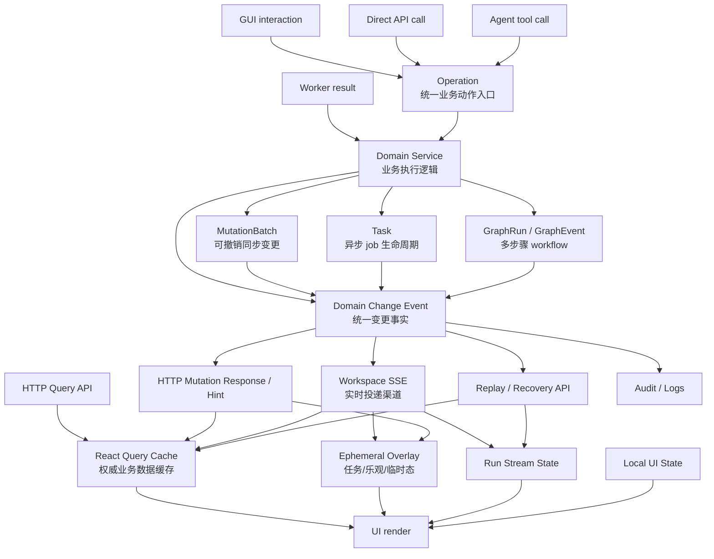
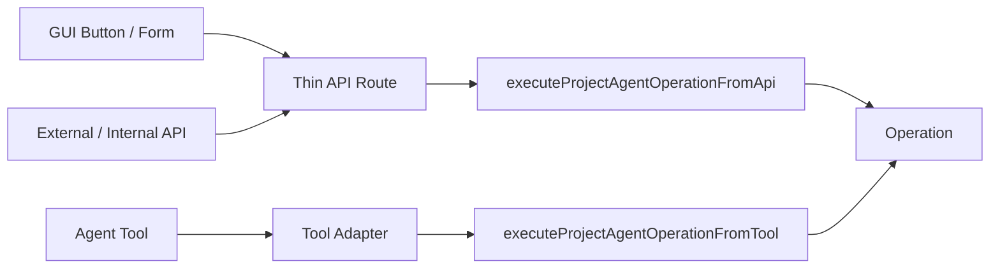
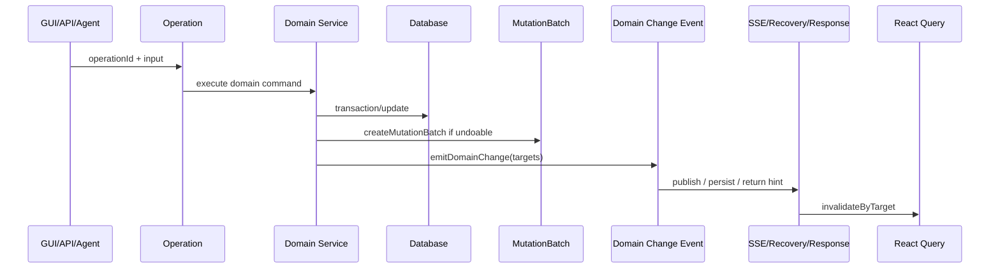
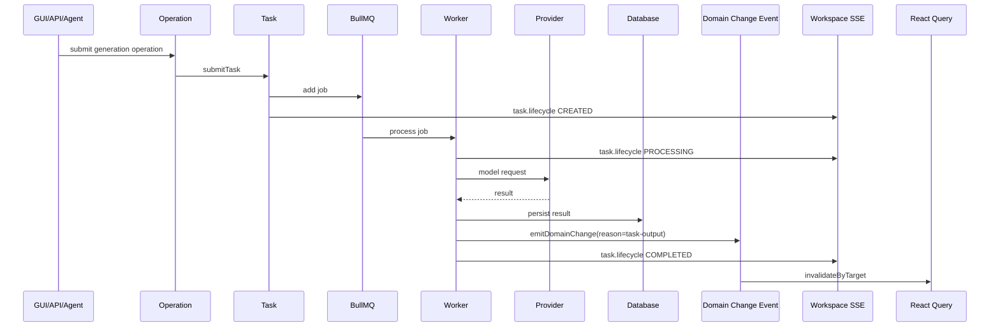
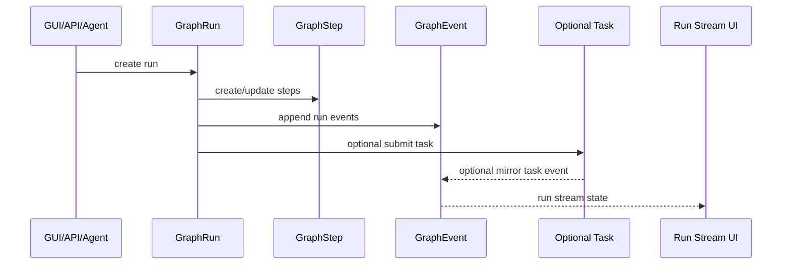
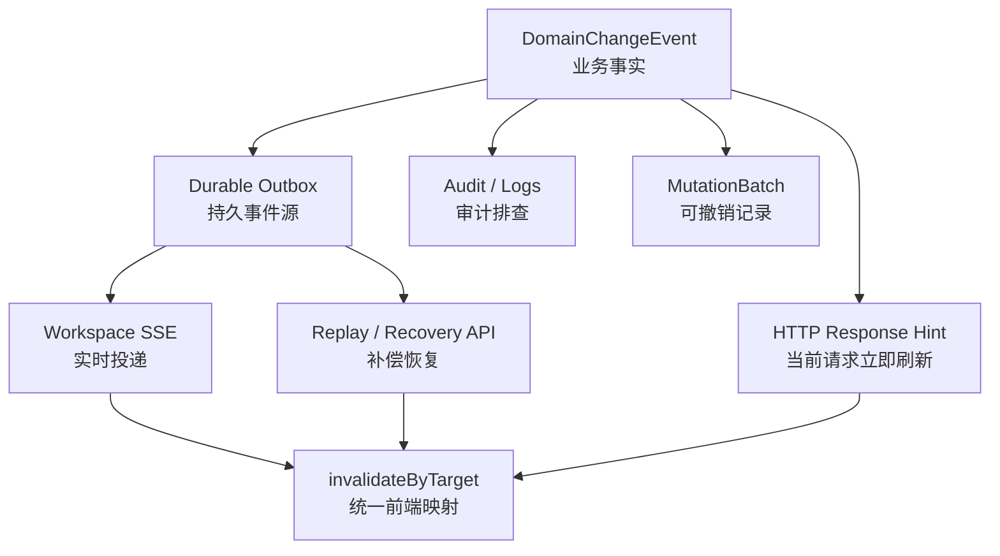
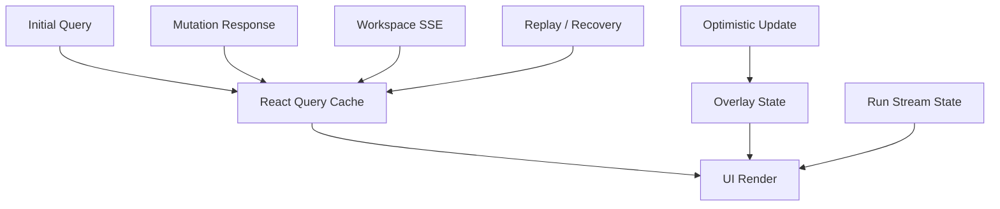

# GUI / API / Agent 统一执行与刷新设计方案

## 1. 设计目标

目标不是让 UI 只依赖 Workspace SSE，而是建立一套更稳定的分层：

```text
所有入口统一进入 Operation
所有后端业务变化产生明确 Change 语义
所有前端刷新进入统一状态层
UI 只消费状态层，不直接消费底层事件
```

最终希望达到：

```text
同一个业务动作
无论来自 GUI、API、Agent tool、Worker
最终都产生一致的后端效果
并让前端以同一套状态刷新逻辑显示出来
```

## 2. 总体架构



## 3. 分层职责

### 3.1 UI Render 层

UI 组件只读统一状态层：

```text
React Query Cache    // 权威业务数据
Overlay State        // 临时任务态 / optimistic 态
Run Stream State     // workflow 过程态
Local UI State       // modal、draft、hover、tab
```

UI 不应该直接依赖：

```text
SSE event payload
HTTP mutation response side effect
worker internal state
agent tool result
```

错误示例：

```ts
if (lastSseEvent.type === 'mutation.batch') {
  hidePanel(lastSseEvent.panelId)
}
```

推荐示例：

```ts
const storyboards = useStoryboards(projectId, episodeId)
```

SSE 只负责让 `useStoryboards()` 背后的 query 失效或恢复。

### 3.2 Entry 层：GUI / API / Agent

所有入口最终都应该进入 Operation。



Route 只负责：

```text
auth
parse params/body
call operation
return response
```

Route 不负责：

```text
复杂 DB transaction
业务判断
query invalidation 策略
直接拼 provider payload
```

### 3.3 Operation 层

Operation 是业务动作入口，声明动作语义：

```ts
{
  id: 'delete_storyboard_panel',
  intent: 'act',
  effects: {
    writes: true,
    billable: false,
    destructive: true,
    longRunning: false,
  },
  channels: {
    tool: true,
    api: true,
  },
}
```

Operation 职责：

```text
输入校验
权限上下文接收
调用 domain service
提交 task
创建 mutation batch
返回 schema 化结果
```

Operation 不应直接包含太多 UI 细节。

## 4. 后端执行分流

### 4.1 同步写入路径

适合：

```text
删除分镜
更新 prompt
调整排序
选择候选图
更新资产字段
保存配置
```



同步写入规则：每个同步写入必须产生明确变更语义。

```ts
emitDomainChange({
  projectId,
  userId,
  source,
  operationId,
  episodeId,
  reason: 'sync-mutation',
  targets: [
    { targetType: 'ProjectStoryboard', targetId: storyboardId },
  ],
})
```

如果可撤销，则同时创建 `MutationBatch`。

### 4.2 异步 Task 路径

适合：

```text
图片生成
视频生成
语音生成
口型同步
LLM 长任务
```



Task 只负责：

```text
queued
processing
completed
failed
progress
billing
retry
dedupe
```

Task 不负责：

```text
undo
业务变更审计
复杂 workflow step graph
```

长期更严谨的设计是：

```text
worker persist result
  -> emitDomainChange(target)
  -> task completed event
```

这样“业务数据变了”和“任务完成了”是两个独立事实。

### 4.3 Workflow / Run 路径

适合：

```text
story-to-script
script-to-storyboard
多步骤 pipeline
可恢复 workflow
有 timeline / artifact / checkpoint 的过程
```



使用 `GraphRun`：

```text
多步骤
需要 timeline
需要 artifact
需要 checkpoint
需要恢复
```

不要使用 `GraphRun`：

```text
单次图片生成
删除分镜
更新字段
普通同步写入
普通单个 task
```

## 5. Domain Change Event 设计

`DomainChangeEvent` 是“业务事实”，不是 SSE 消息。SSE 只是投递渠道之一。

建议类型：

```ts
type DomainChangeEvent = {
  id: string
  type: 'domain.changed'
  projectId: string
  userId: string
  source: 'project-ui' | 'assistant-panel' | 'worker' | 'api'
  operationId: string | null
  episodeId: string | null
  targets: Array<{
    targetType: string
    targetId: string
  }>
  reason:
    | 'sync-mutation'
    | 'task-output'
    | 'workflow-output'
    | 'undo'
  ts: string
}
```

消费渠道：

| 渠道 | 作用 | 是否实时 | 是否必须 |
| --- | --- | --- | --- |
| Workspace SSE | 当前打开页面实时收到变更 | 是 | 推荐 |
| Replay / Recovery API | 断线重连、页面恢复、补漏 | 否/准实时 | 强烈推荐 |
| Mutation HTTP response hint | 当前发起请求的客户端可立即 invalidate/setQueryData | 是 | 可选 |
| Audit / logs | 排查谁在何时改了什么 | 否 | 推荐 |
| Undo / MutationBatch | 可撤销变更的恢复依据 | 否 | 仅可撤销操作需要 |
| Worker/internal subscriber | 后台派生流程、索引、统计 | 否 | 按需 |

关系图：



短期可以不一次性上 outbox 表，但设计上不要把 `DomainChangeEvent` 等同于 SSE。

## 6. Frontend State Layer 设计

UI 最终只从这些 hook 读数据：

```ts
useProjectData()
useStoryboards()
useVoiceLines()
useAssets()
useTaskTargetStateMap()
useRunStreamState()
```

不要让组件直接消费底层事件。

刷新来源：



刷新规则：

| 来源 | 可做什么 | 不应做什么 |
| --- | --- | --- |
| Initial Query | 加载权威数据 | 不处理 mutation |
| Mutation Response | setQueryData 或 invalidate | 不伪造后端未返回的数据 |
| Workspace SSE | 跨入口 invalidate | 不直接渲染完整业务对象 |
| Recovery | 断线/刷新恢复 | 不静默掩盖错误 |
| Optimistic | 临时体验 | 不当作最终事实 |

## 7. `invalidateByTarget()` 设计

`invalidateByTarget()` 是前端刷新统一规则源。

```ts
invalidateByTarget({
  targetType: 'ProjectStoryboard',
  targetId: storyboardId,
  projectId,
  episodeId,
})
```

内部决定刷新：

```text
ProjectPanel / ProjectStoryboard / ProjectShot
  -> episodeData
  -> storyboards
  -> voiceLines if needed

ProjectCharacter / CharacterAppearance
  -> projectAssets.characters
  -> projectAssets.all
  -> unified project assets

GlobalCharacter
  -> globalAssets.characters
  -> unified global assets
```

规则：

```text
新增 targetType 必须同步更新 invalidateByTarget 测试
禁止在每个 hook 里复制刷新规则
```

## 8. 最终规则总结

后端规则：

```text
GUI/API/Agent -> Operation
Operation -> Domain Service
同步写入 -> DomainChangeEvent
可撤销同步写入 -> MutationBatch + DomainChangeEvent
异步执行 -> Task + TaskEvent
异步结果落库 -> DomainChangeEvent
多步骤 workflow -> GraphRun + GraphEvent
```

前端规则：

```text
UI 不直接依赖 SSE payload
UI 读 React Query + Overlay + RunState + LocalState
SSE 只负责触发状态层更新
业务刷新规则集中在 invalidateByTarget
Optimistic 只是临时态
Recovery 是显式恢复机制
```

一句话版本：

> Operation 统一入口，DomainChangeEvent 统一变更事实，React Query 统一权威数据，Overlay/RunState 统一过程态，UI 只消费状态层；SSE 是通知通道之一，不是唯一渲染依据。
